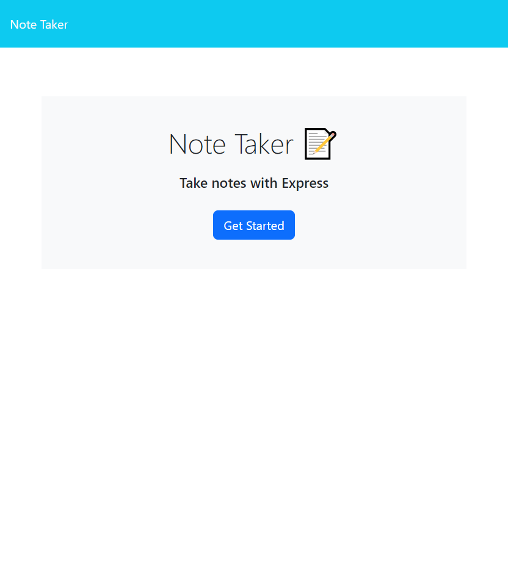
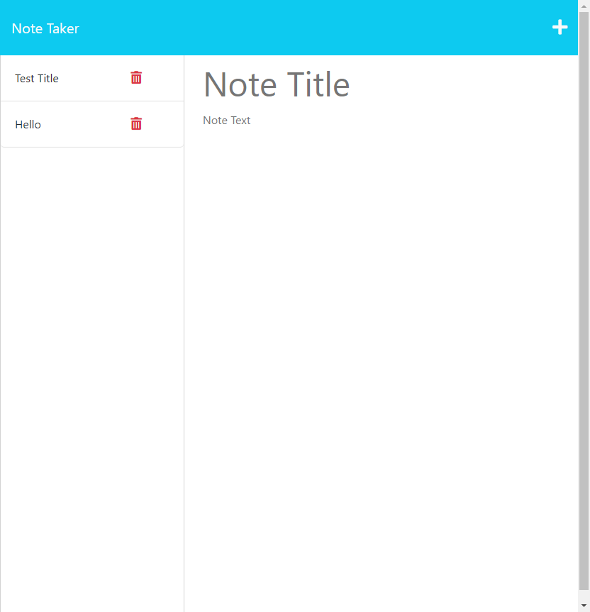

# Note Taker Application
## About
For this project I was given starter code, I set up a server that uses express and api routes to be able to get and post new notes to the application. Users come to the homepage and click "Get Started" to navigate to the note page where they can view previous notes and post new ones that will be saved to the note database.
## Screenshots

## Link
Open [https://note-taker-production-f11c.up.railway.app/](https://note-taker-production-f11c.up.railway.app/) with your browser to see the result.